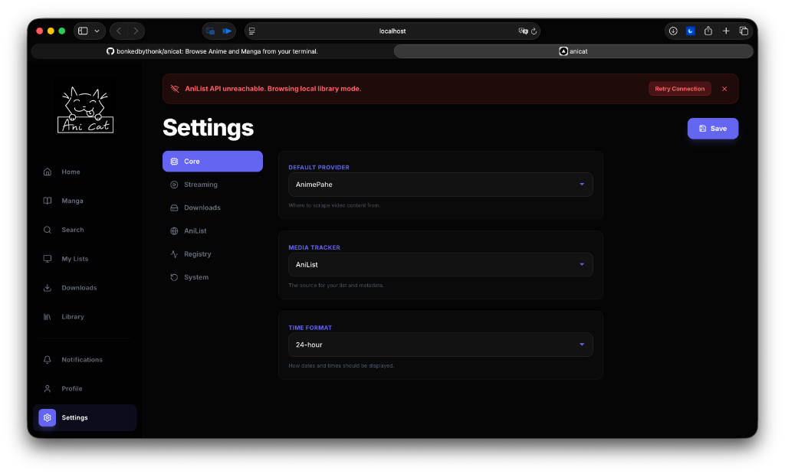

# 🐱 Anicat

**Your premium anime and manga companion for macOS.**  
Stream, track, and download your favorite media with a beautiful, minimalist experience.



---

## 🚀 Quick Start (2 Steps)

### 1. Open Terminal & Install
Open your **Terminal** (Cmd+Space, type `terminal`, and press Enter).  
Copy and paste this entire line and press Enter:

```bash
git clone https://github.com/bonkedbythonk/anicat.git && cd anicat && ./scripts/install.sh
```

### 2. Enjoy!
The installer will handle everything (including system tools like `mpv`) and automatically open the **Anicat Dashboard** in your browser.

---

## ✨ Features

- **Premium Dashboard**: A sleek, dark-themed web interface with glassmorphism aesthetics.
- **Smart Progress Sync**: Instant, "Local-First" syncing with **AniList**. Your progress updates are reflected the microsecond you click.
- **Anime Streaming**: Search and stream high-quality episodes (up to 1080p).
- **Manga Reader**: A clean, distraction-free reader for your favorite chapters.
- **Offline Mode**: Full registry support to track your library even without an internet connection.
- **Mobile Access**: Built-in support for iPhones and Tablets on your local network.

---

## 🛠 Managing Anicat

Anicat is designed to stay out of your way. Once installed, you can control it with these simple commands:

### **Start the Server**
Launch the dashboard and hide it in the background:
```bash
anicat dashboard &
```
*Note: You can close your terminal immediately after running this!*

### **Stop the Server**
Shut down the background dashboard safely:
```bash
anicat stop
```

### **One-Click Updates**
Instead of using the terminal, you can simply click the **"Update"** button in the **Settings > Maintenance** tab on the website. The app will pull the latest code, rebuild itself, and restart automatically.

---

## 📱 Mobile Use
Want to watch on your iPhone? 
1. Run `anicat dashboard`.
2. Look for the **"Remote"** URL in the terminal (e.g., `http://192.168.1.50:8000`).
3. Open that URL on your phone! 
*Tip: On iPhone, tap the "Share" button and select **"Add to Home Screen"** to use Anicat like a native app.*

---

## ❓ Troubleshooting

**"Destination path 'anicat' already exists"**
Run this to overwrite and start fresh:
```bash
rm -rf anicat && git clone https://github.com/bonkedbythonk/anicat.git && cd anicat && ./scripts/install.sh
```

**"Command not found: anicat"**
Restart your terminal or run `source ~/.zshrc`.

**Homebrew or MPV missing?**
Don't worry! The installer will detect them and ask to install them for you automatically.

---

## ⚖️ License
Anicat is a specialized macOS fork of the [Viu](https://github.com/viu-media/viu) project, refined for a premium dashboard experience and "Zero-Knowledge" automation.
Licensed under the [UNLICENSE](https://unlicense.org/).
