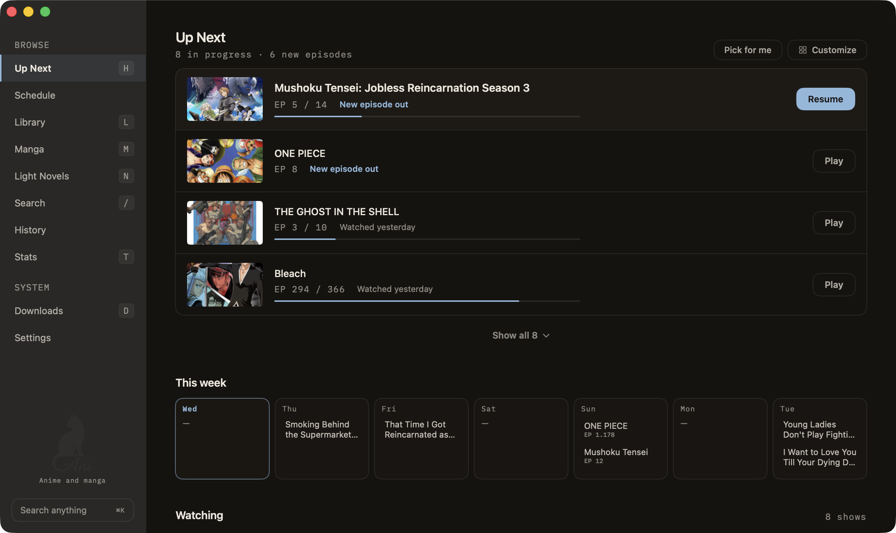

<div align="center">
  <h1>Anicat</h1>
  <p><strong>Stream, track, and organize anime and manga — a native desktop app powered by AniList.</strong></p>

  <p>
    
    
  </p>

  
</div>

---

Anicat is a native macOS desktop app for AniList users who want to watch, read, and track anime and manga without touching a browser. It wraps a Svelte/Tauri frontend around mpv for video playback, a Python scraper sidecar for episode sourcing, and a full two-way AniList sync — so your library, progress, and scores stay current automatically.

---

## Quick Install

Paste in Terminal:
```bash
curl -fsSL https://raw.githubusercontent.com/bonkedbythonk/anicat/master/scripts/install_macos.sh | bash
```

---

## Features

- **Stream & Playback** — External mpv player with Anime4K upscaling and AniSkip, or embedded HLS player. Multi-provider fallback, sub/dub server selection, HLS proxy.
- **Manga Reader** — Read chapters with three viewing modes (single, double, vertical scroll), RTL/LTR support, keyboard navigation, and AniList progress sync.
- **AniList Sync** — Full library sync: progress, scores, list status. Watched episodes auto-register on mpv close. Inline editing in the detail drawer.
- **Download Queue** — Background downloader via yt-dlp with real-time progress. Browse and play offline library.
- **Schedule** — 7-day airing calendar with live countdowns. Filter to your watching list.
- **Discovery** — Home dashboard with configurable rows (trending, seasonal, airing today, continue watching, smart picks). Search with filters. Notification feed from AniList.
- **Discord Rich Presence** — Shows what you're watching in your Discord status.
- **Skins** — Three UI styles: Neon Abyss (default), Sakura Zen (serif), Retro Manga (Bangers + Japanese sans-serif).
- **Nightly Builds** — Early-access features. Switch via Settings → Update Branch.

## Branches

| Branch | Use |
|--------|-----|
| `master` | Stable releases. Tested, reviewed, ready for daily use. |
| `nightly` | Latest features and fixes. May be less stable. |

## Building from Source

**Prerequisites:**
- Rust (stable toolchain)
- Node.js
- [uv](https://docs.astral.sh/uv/) — manages the Python scraper sidecar in `scraper/`
- `mpv` — `brew install mpv`
- System deps for [Tauri v2](https://v2.tauri.app/start/prerequisites/)

```bash
git clone https://github.com/bonkedbythonk/anicat.git
cd anicat/web
npm install
npm run tauri dev
```

## Dependencies

| Dependency | Purpose |
|-----------|---------|
| [AniList](https://anilist.co) | Library, tracking, search, profile |
| [mpv](https://mpv.io) | External media player (recommended) |
| [yt-dlp](https://github.com/yt-dlp/yt-dlp) | Episode downloading |
| [Python 3](https://python.org) | Required for CLI/TUI mode & building from source |

## Legal

Anicat is for educational and personal use only. See [DISCLAIMER.md](DISCLAIMER.md) and [SECURITY.md](SECURITY.md).

## License

[GNU General Public License v3.0](LICENSE)
