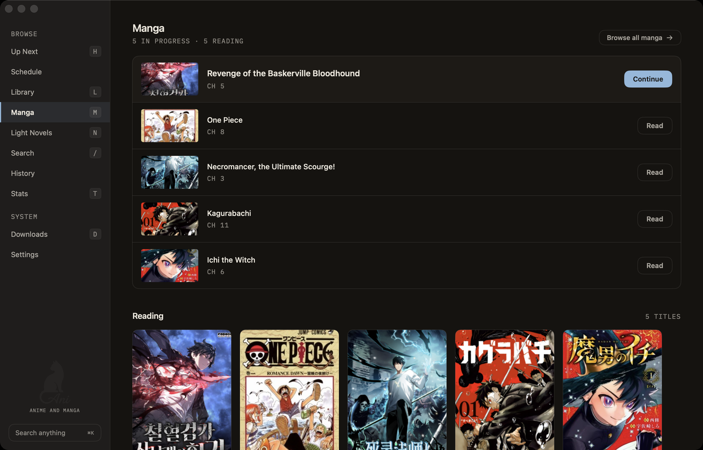

<div align="center">
  
  <h1>Anicat</h1>
  <p><strong>Stream, track, and organize anime and manga — a native desktop app powered by AniList.</strong></p>

  <p>
    
    
    
  </p>

  
</div>

---

Anicat is a native desktop app for AniList users who want to watch, read, and track anime and manga without touching a browser. It wraps a React/Tauri frontend around mpv for video playback, a Python scraper sidecar for episode sourcing, and a full two-way AniList sync — so your library, progress, and scores stay current automatically.

---

## Table of Contents

- [Install](#install)
- [First-run Setup](#first-run-setup)
- [Features](#features)
- [Screenshots](#screenshots)
- [Building from Source](#building-from-source)
- [Dependencies](#dependencies)
- [Legal](#legal)

---

## Install

### macOS

The DMG is unsigned, and modern macOS blocks unsigned apps outright ("Apple could not verify... this app may contain malware") with no right-click-to-open bypass — the install script below handles this for you, which is why it's the recommended path:

```bash
curl -fsSL https://raw.githubusercontent.com/bonkedbythonk/anicat/master/scripts/install_macos.sh | bash
```

If you'd rather download the `.dmg` manually from the [Releases page](https://github.com/bonkedbythonk/anicat/releases/latest), copy `Anicat.app` to `/Applications`, then clear the quarantine flag yourself in Terminal:

```bash
xattr -r -d com.apple.quarantine /Applications/Anicat.app
```

### Windows

Download the latest `Anicat_*_x64-setup.exe` from the [Releases page](https://github.com/bonkedbythonk/anicat/releases/latest) and run it. Windows SmartScreen may warn about an unknown publisher — click **More info → Run anyway**.

---

## First-run Setup

On first launch, Anicat walks you through setup automatically:

1. Pick a theme and configure basic preferences.
2. Connect your AniList account — the app opens a browser window to authorize, then redirects back.
3. Your library loads and the home screen populates.

AniList is only used for tracking. Playback and the episode list do not require an account.

---

## Features

- **Up Next** — A single "continue where you left off" queue across every show in progress, plus a "Pick for me" random-episode button for when you can't decide.
- **Stream & Playback** — External mpv player with Anime4K upscaling and AniSkip (intro/outro skip). Mkissa and AniNeko scraper providers with automatic fallback between them, plus a torrent-backed provider (SubsPlease API + Nyaa RSS) that streams straight from the swarm while it downloads — no waiting for the file to finish. Sub/dub selection, resume position, auto-next into the following episode.
- **Trailers** — View a title's trailer directly from the detail page.
- **Manga Reader** — Three viewing modes (single page, double page, vertical scroll), RTL/LTR support, trackpad swipe navigation, vertical sidebars for unobstructive desktop reading, and AniList progress sync.
- **AniList Sync** — Full library sync: progress, scores, list status. Watched episodes register automatically when mpv closes. Inline editing from the detail page.
- **Download Queue** — Background episode downloader via yt-dlp with real-time progress. Downloaded episodes play directly from the app.
- **Schedule** — 7-day airing calendar filtered to your watching list.
- **Discovery** — Customizable home layout (show/hide rows: trending, seasonal, airing today, continue watching, smart picks). Search with genre, year, and score filters.
- **Mobile PWA** — A purpose-built phone frontend (poster grids, bottom sheets, native HLS playback), installable as a home-screen app. Leave the desktop app running and open it from your phone's browser while on the same Wi-Fi — browsing, search, lists, and playback, all PIN-gated. Downloads aren't available from the phone.
- **Discord Rich Presence** — Shows what you are watching in your Discord status.
- **Themes** — Three UI styles: Neon Abyss (default), Sakura Zen (serif), Retro Manga.
- **Keyboard-driven** — Shortcuts for navigating every view, with a built-in cheat sheet (`?`).
- **Self-updating** — Checks for new releases and installs updates in place, no manual reinstall.

---

## Screenshots

<div align="center">
  
  <br><br>
  
  <br><br>
  
</div>

---

## Building from Source

**Prerequisites:**

- [Rust](https://rustup.rs/) stable toolchain
- [Node.js](https://nodejs.org/) 18+
- [uv](https://docs.astral.sh/uv/) — Python environment manager for the scraper sidecar
- `mpv` — `brew install mpv` (macOS) or download from [mpv.io](https://mpv.io) (Windows)
- Tauri v2 system dependencies — see [Prerequisites](https://v2.tauri.app/start/prerequisites/)

```bash
git clone https://github.com/bonkedbythonk/anicat.git
cd anicat

# Install Python scraper dependencies
uv sync --dev --all-extras

# Install frontend dependencies and run in dev mode
cd web
npm install
npm run tauri dev
```

The dev build uses the Python scraper source files directly. The production build (`npm run tauri build`) freezes them into a standalone binary via PyInstaller.

---

## Dependencies

| Dependency | Purpose |
|---|---|
| [AniList](https://anilist.co) | Library, tracking, search, profile data |
| [mpv](https://mpv.io) | External media player |
| [yt-dlp](https://github.com/yt-dlp/yt-dlp) | Episode downloading |
| [Python 3](https://python.org) | Scraper sidecar runtime (build only) |

---

## Legal

Anicat is for educational and personal use only. See [DISCLAIMER.md](DISCLAIMER.md) and [SECURITY.md](SECURITY.md).

## License

[GNU General Public License v3.0](LICENSE)
