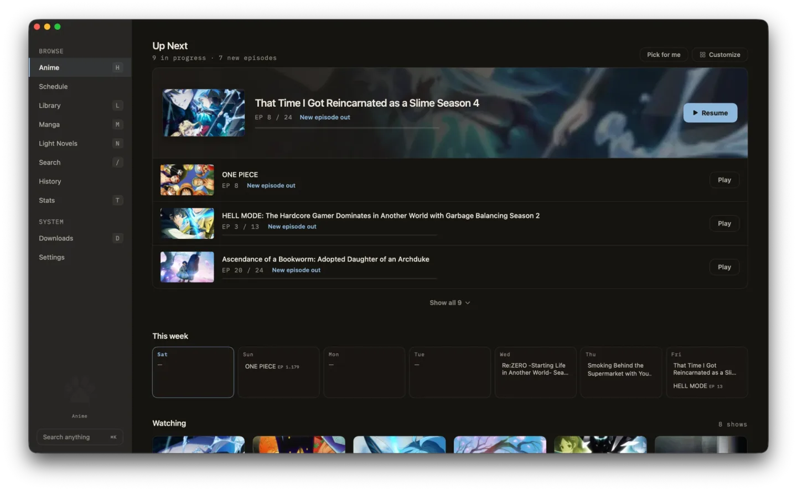
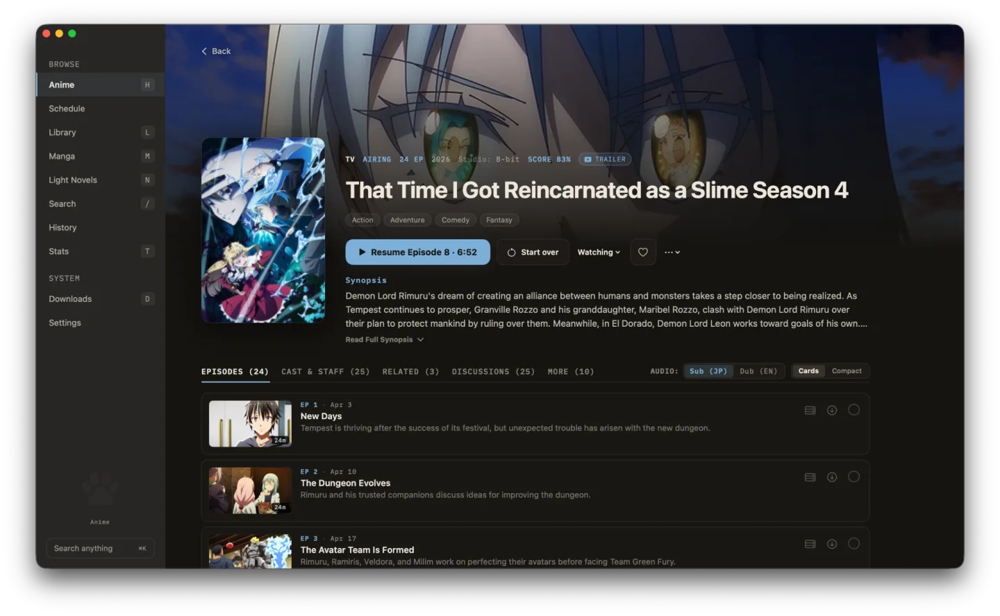
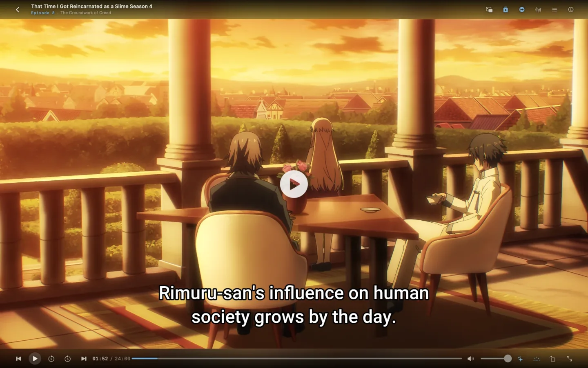
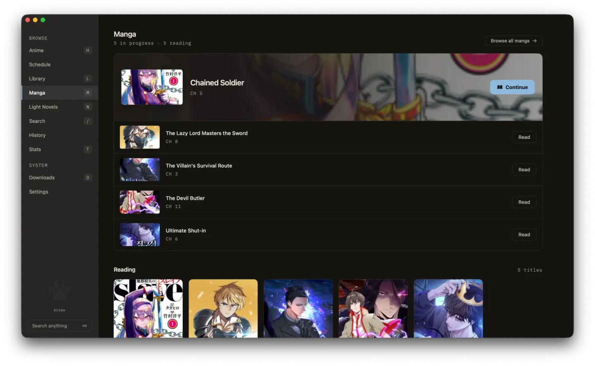
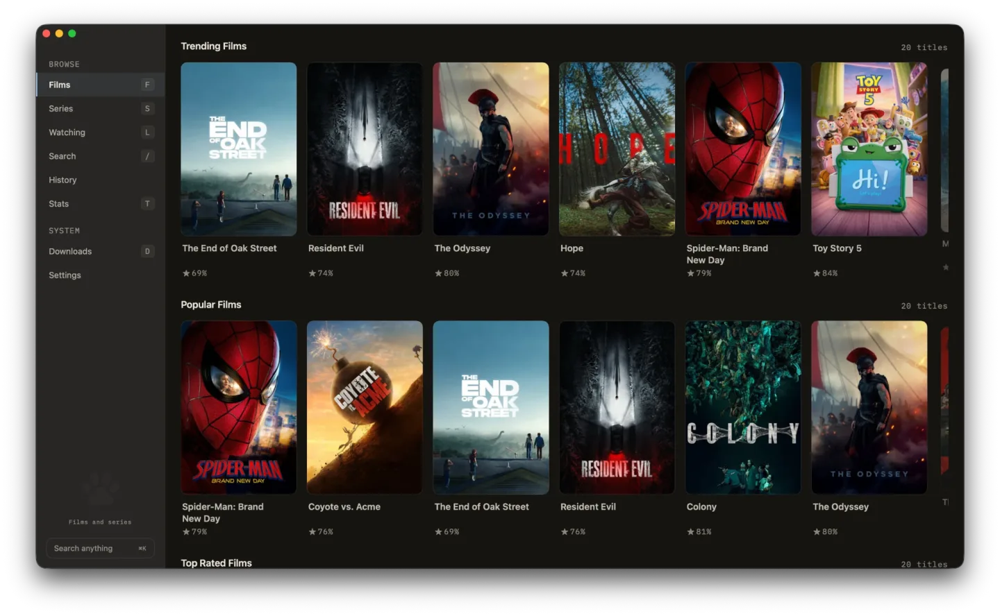

<div align="center">
  <picture>
    <source media="(prefers-color-scheme: dark)" srcset="assets/branding/logo-dark.png">
    
  </picture>
  <h1>Anicat</h1>
  <p>Watch anime, read manga and light novels, and keep your AniList up to date. A native Mac app.</p>

  <p>
    
    
    
  </p>

  
</div>

## Features

- Search a show, press play. No sites, no mirrors, no waiting for a download.
- Progress syncs to [AniList](https://anilist.co) on its own.
- Skip openings and endings, auto-play the next episode, optional upscaling.
- Manga reader (MangaDex) and light novel reader.
- Films and TV too.

## Screenshots

<table>
  <tr>
    <td></td>
    <td></td>
  </tr>
  <tr>
    <td></td>
    <td></td>
  </tr>
</table>

More in [docs/SCREENSHOTS.md](docs/SCREENSHOTS.md).

## Install

**Mac** (Apple silicon, macOS 15 or later). Paste into Terminal:

```bash
curl -fsSL https://raw.githubusercontent.com/bonkedbythonk/anicat/master/scripts/install_macos.sh | bash
```

**Windows** (10 or 11, anime and films only). Paste into PowerShell:

```powershell
irm https://raw.githubusercontent.com/bonkedbythonk/anicat/master/scripts/install_windows.ps1 | iex
```

Run the same line again to update.

<details>
<summary>Other ways to install</summary>

**By hand:** download the `.dmg` from [Releases](https://github.com/bonkedbythonk/anicat/releases)
and drag Anicat to Applications. The app is not notarized, so macOS blocks
the first launch: go to System Settings > Privacy & Security and click
**Open Anyway**, or run
`xattr -dr com.apple.quarantine /Applications/Anicat.app`.

**Nightly** (newest changes, untested):

```bash
curl -fsSL https://raw.githubusercontent.com/bonkedbythonk/anicat/master/scripts/install_macos.sh | bash -s -- --nightly
```

**Mirror**, if GitHub is down:

```bash
curl -fsSL https://anicat-releases.anicat.workers.dev/install.sh | bash
```

</details>

## Disclaimer

Anicat hosts no content. Anime, films and TV come from public BitTorrent
swarms, so your IP address is visible to other peers and your internet
provider, as with any torrent client (uploading is off). Use it at your own
risk under your local laws. More in [DISCLAIMER.md](DISCLAIMER.md) and
[PRIVACY.md](PRIVACY.md).

Personal project, no support promised. Building from source is in
[CONTRIBUTING.md](CONTRIBUTING.md). If you like it:
[ko-fi.com/bonkedbythonk](https://ko-fi.com/bonkedbythonk).

Licensed under [GPLv3](LICENSE).
