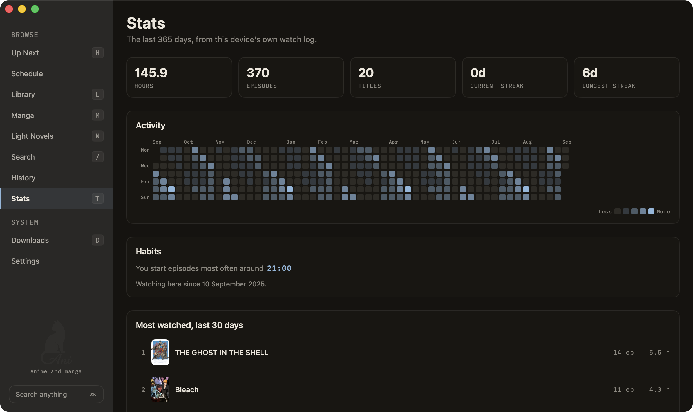

<div align="center">
  
  <h1>Anicat</h1>
  <p><strong>Watch, read, and track anime, manga, light novels and film — a native desktop app powered by AniList.</strong></p>

  <p>
    
    
    
  </p>

  
</div>

---

Anicat is a native macOS app for AniList users who want to watch, read, and track without touching a browser. It is a SwiftUI app over a Rust engine, with libmpv rendering video inside the window, an embedded torrent engine for anime, and full two-way AniList sync so your library, progress and scores stay current automatically.

It covers four kinds of media, and they do not share a backend:

| Mode | Catalog | Source | State |
|---|---|---|---|
| Anime | AniList | Torrents, streamed while they download | working |
| Manga | AniList | MangaDex, MangaKatana fallback | working |
| Light novels | AniList | Syosetu | early |
| Film and TV | TMDB | Torrents | catalog only, playback not wired yet |

The app was rewritten from Tauri/React to Swift in 2026. macOS is the shipping product; an iPhone target builds and runs on the simulator, and the phone layout is still to come.

> **Disclaimer:** Anicat hosts zero content — it scrapes publicly accessible third-party sites and streams from public torrent swarms. It is for educational and personal use only, and use is at your own risk under your local laws. The developer has no affiliation with any content provider and is not responsible for how the app is used. See [DISCLAIMER.md](DISCLAIMER.md) for the full text.

---

## Table of Contents

- [Install](#install)
- [First-run Setup](#first-run-setup)
- [Features](#features)
- [Screenshots](#screenshots)
- [Building from Source](#building-from-source)
- [Dependencies](#dependencies)
- [Legal](#legal)
- [License](#license)

---

## Install

Apple silicon, macOS 15 or later. Download
`Anicat-<version>-macos-arm64.zip` from the
[Releases page](https://github.com/bonkedbythonk/anicat/releases), unzip it
and move `Anicat.app` to `/Applications`. Or let the installer do it:

```bash
curl -fsSL https://raw.githubusercontent.com/bonkedbythonk/anicat/master/scripts/install_macos.sh | bash
```

The build is ad-hoc signed, not notarized. On first launch right-click the
app and choose Open, or clear the quarantine flag:

```bash
xattr -dr com.apple.quarantine /Applications/Anicat.app
```

Releases up to v5.8.0 are the retired Tauri app and are not upgrades to
6.x — see [RELEASE_NOTES.md](RELEASE_NOTES.md) for what carries over.

---

## First-run Setup

On first launch Anicat walks you through setup:

1. Connect your AniList account: Settings opens the AniList authorization page in your browser, and you paste the redirect URL (or the token in it) back into the app. The token is stored in the local Keychain.
2. Your library loads and the home screen populates.

AniList is only used for tracking. Playback and the episode list do not require an account.

---

## Features

- **Up Next** — One "continue where you left off" queue across every show in progress, a "Pick for me" random-episode button, and a customizable home layout (Trending, Newly Releasing, Seasonal, Planning).
- **Playback** — libmpv drawn inside the window through Metal, at the display's full refresh rate. Anime4K upscaling, AniSkip intro and outro skip keyed to the file's real length, resume position, auto-next with the next episode preloaded at 75%, a corner mini-player so the rest of the app stays usable, sideways mode for a rotated screen, and the display kept awake while a stream plays. Streams come straight from the swarm while they download: candidates are gathered from SubsPlease, AnimeTosho, Nyaa and SeaDex in one pass, the best two raced against each other, and the release that won is remembered for next time.
- **Player info popover** — Audio and subtitle tracks listed by language and title, a Sub/Dub switch that keeps full subtitles, a release switcher that resumes at the same position, speed, and an optional keyboard backlight dimmer for night watching.
- **Detail pages** — Episodes with thumbnails and air dates, cast with in-app character, voice actor and staff pages, relations and recommendations, AniList forum threads read in the app, and a "Start over" beside Resume. Browser-style back and forward, two-finger swipe included, with the poster morphing from the card you opened and the hero banner settling into a compact header as you scroll.
- **Manga reader** — Single page, two-page spread, vertical scroll, RTL and LTR, tap zones and trackpad page turns, AniList progress sync. MangaDex first, MangaKatana when a title has been pulled from MangaDex.
- **Light novels** — In-app reader for Syosetu web novels with typography controls and per-chapter progress.
- **AniList sync** — Progress, scores and list status. Progress is reported continuously while you watch, and an episode registers as watched once playback passes 85%. Inline editing from the detail page; Planning shelves on the manga and novel pages.
- **Library** — Every AniList status as a grid or table, anime and manga.
- **Downloads and History** — Keep an episode's torrent for offline playback with Play, Reveal in Finder and Remove per row; a local watch log you can open, prune or clear.
- **Schedule** — 7-day airing calendar, everything airing or just your watching list.
- **Search** — Genre, year, season, format, score, status and sort filters.
- **Continuity** — Handoff of playback and reading between Macs on the same Apple ID, Bonjour discovery of other instances.
- **Discord Rich Presence** — Optional, off with one switch.
- **Keyboard-driven** — A command palette and shortcuts for every view, with a built-in cheat sheet (`?`).

---

## Screenshots

<div align="center">
  
  <br><br>
  
  <br><br>
  
  <br><br>
  
</div>

The screenshots come from a build run with `ANICAT_SCREENSHOT_MODE=1`, which
swaps the personal data (lists, history, profile, statistics) for fixtures
built from the trending catalog, so they show layout rather than anyone's
watch history.

---

## Building from Source

**Prerequisites:**

- macOS 15 or later on Apple silicon, with Xcode's command line tools (Swift 6)
- [Rust](https://rustup.rs/) stable, with the Apple targets: `rustup target add aarch64-apple-darwin aarch64-apple-ios aarch64-apple-ios-sim`
- No mpv install needed: libmpv and FFmpeg come from [MPVKit](https://github.com/mpvkit/MPVKit) as SwiftPM binary dependencies (about 1.7 GB of xcframeworks on first resolve)

```bash
git clone https://github.com/bonkedbythonk/anicat.git
cd anicat

# Compile the Rust engine for every Apple target and generate the Swift
# bindings. Once after cloning, and again after any change to core/src/ffi.rs.
bash scripts/build-xcframework.sh

# Build and run
cd AnicatApple
swift build --product Anicat
bash dev-run.sh        # copies the binary into dist/Anicat.app and opens it
```

Useful while working on it:

```bash
cd AnicatApple && swift test
cd core && cargo test --lib && cargo clippy --lib --tests -- -D warnings
```

`scripts/package-anicat-macos-app.sh release` produces a standalone `.app`
in `AnicatApple/dist/`; add `install` to replace `/Applications/Anicat.app`
with it. `bash AnicatApple/dev-run.sh` rebuilds a debug copy in `dist/` and
relaunches it, and never touches the installed one.

---

## Dependencies

| Dependency | Purpose |
|---|---|
| [AniList](https://anilist.co) | Library, tracking, search, profile data for anime, manga and novels |
| [TMDB](https://themoviedb.org) | Catalog for film and TV |
| [mpv](https://mpv.io) via [MPVKit](https://github.com/mpvkit/MPVKit) | Media playback, libmpv linked statically, drawn through Metal |
| [librqbit](https://github.com/ikatson/rqbit) | Embedded torrent engine |
| [MangaDex](https://mangadex.org), [MangaKatana](https://mangakatana.com) | Manga chapters |
| [Syosetu](https://syosetu.com) | Web novels |
| [AniSkip](https://api.aniskip.com) | Intro and outro timestamps |
| [UniFFI](https://mozilla.github.io/uniffi-rs/) | Rust to Swift bindings |

---

## Legal

Anicat is for educational and personal use only. See [DISCLAIMER.md](DISCLAIMER.md) and [SECURITY.md](SECURITY.md).

## License

[GNU General Public License v3.0](LICENSE)
