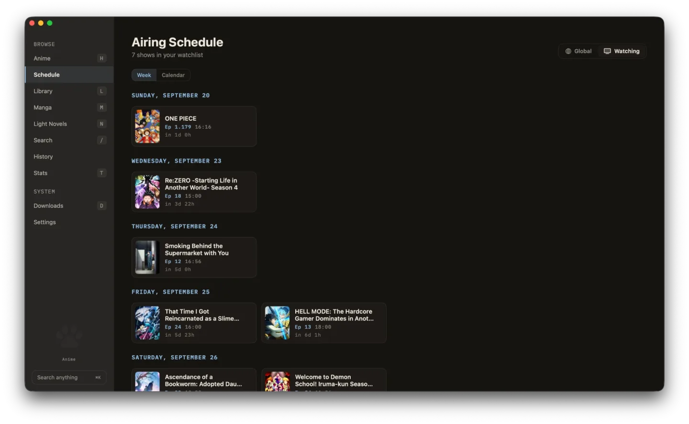
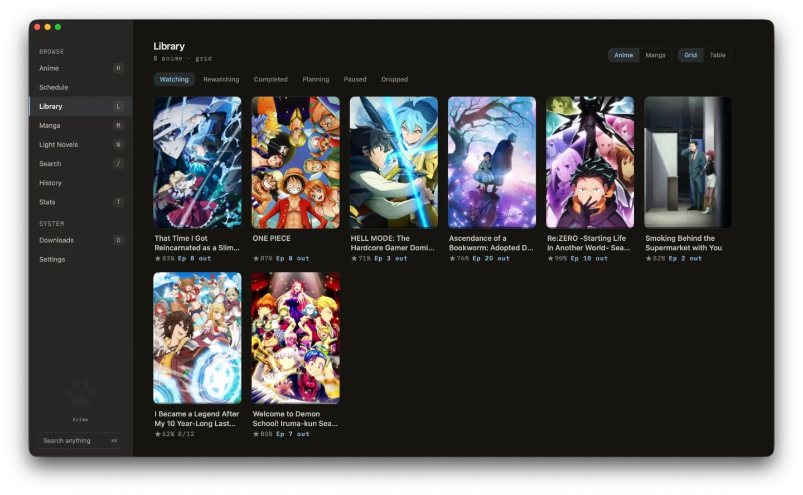
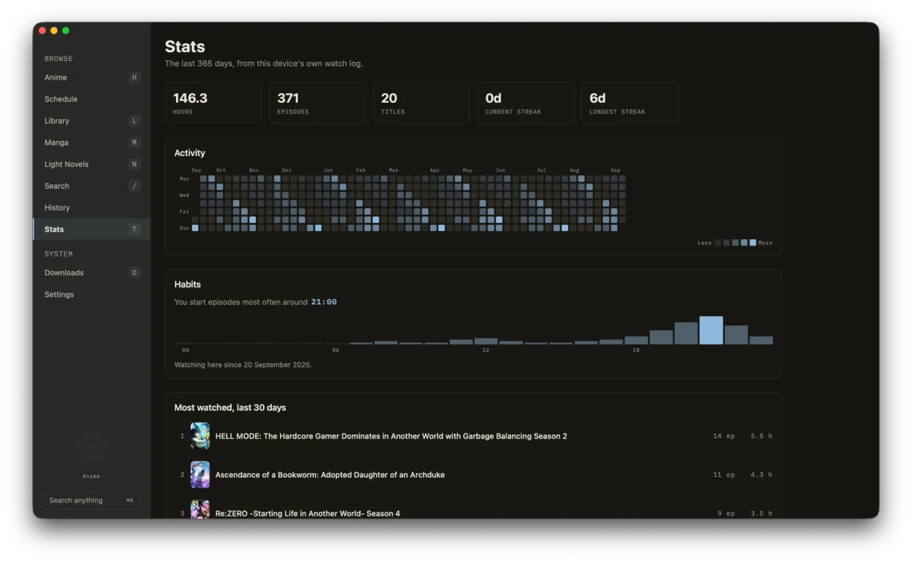
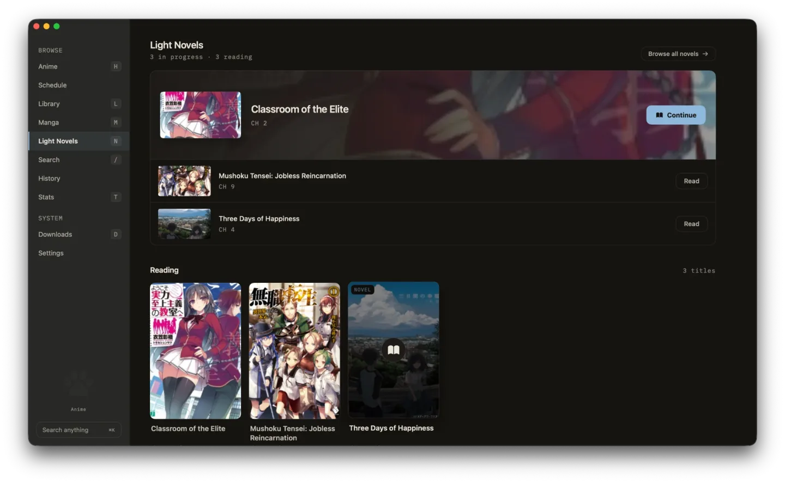
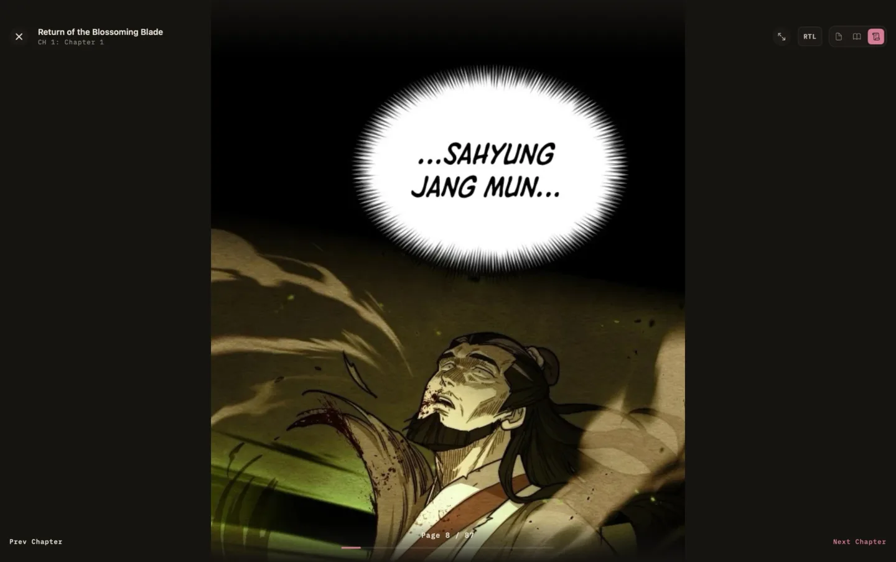
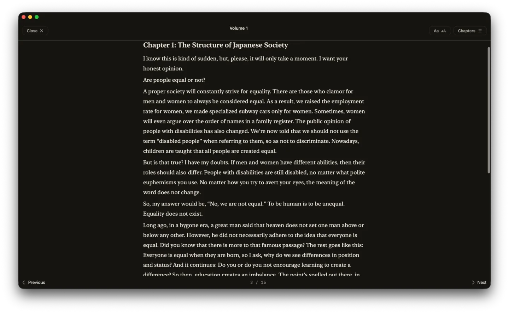
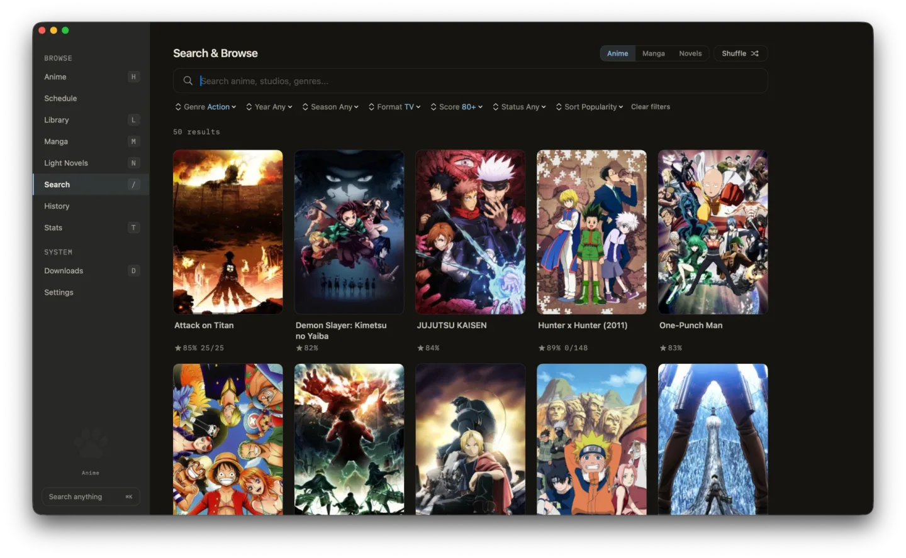
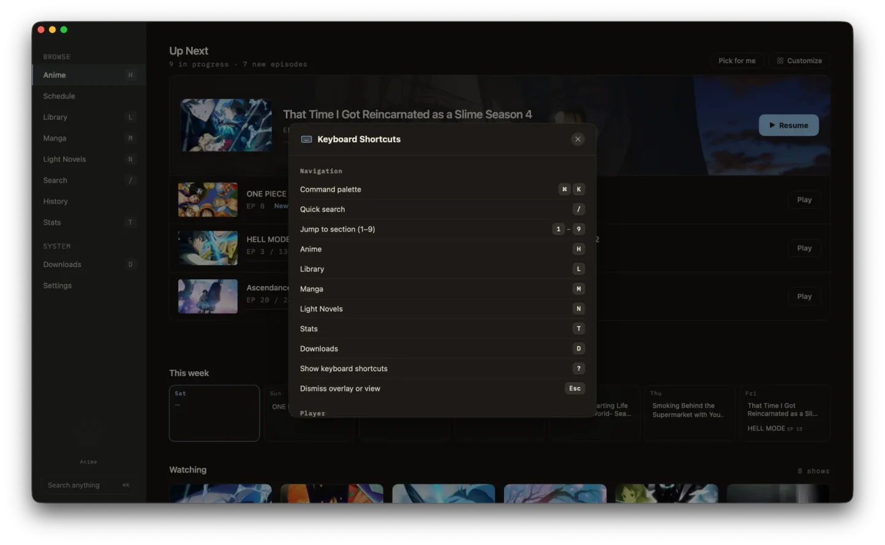
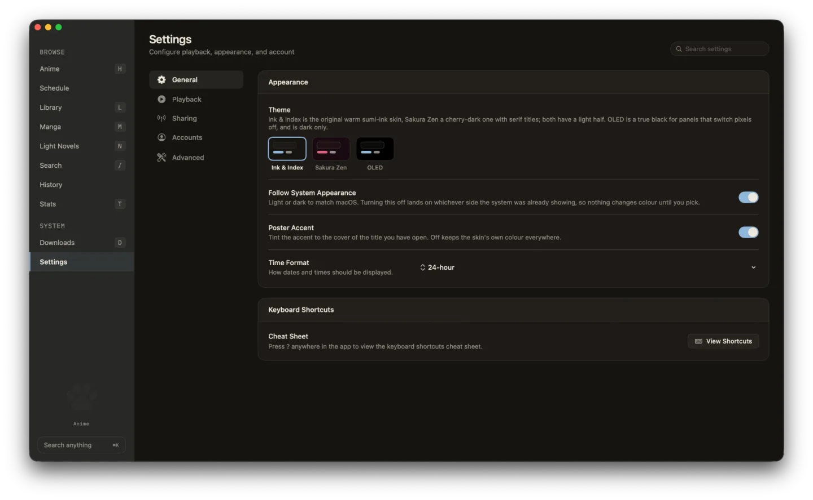

# Screenshots

The [README](../README.md) has the short version: the home
screen, a detail page, the player, manga and films. These are the rest.

Every shot is from a build run with `ANICAT_SCREENSHOT_MODE=1`, which swaps
the personal data (lists, history, profile, statistics) for fixtures built
from the trending catalog. The catalog itself stays real, so the covers and
counts are whatever AniList has that week and the shots do not date; what is
missing is any trace of what the owner actually watches.

## What airs this week

  

## Your lists

  
    
  

## Reading

  
    
  
    
  

## Finding things, and getting around

  
    
  
    
  

